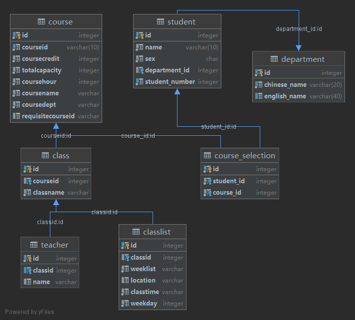
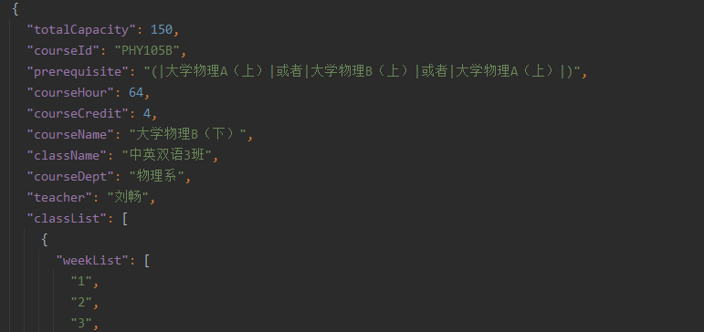
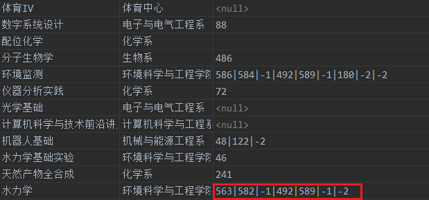

# CS307 Project Report (Midterm)

## Part 1. Group Info and Contribution


## Part 2. Task 1 Implementation & Introduction

### 1. Table Diagram

Figure 2-1 shows the UML diagram of the tables generated by DataGrip.



<center style="font-family:Arial;font-weight:bold">Figure 2-1. UML diagram of the tables</center>

### 2. Introduction

There are 7 tables in total:

The four tables `course`, `class`, `teacher`, `classlist` are used to store the data in `course_info.json`. The other three tables `student`, `department`, `course_selection` are used to store the data in `select_course.csv`. 

In `course_info.json`, each entry is the information of one class of one course. We extracted the information of the courses into the table `course`, and store the information of the classes in a one-to-many relation table `class`. We store the relation between teachers and classes, class lists and classes in the same way.

In `select_course.csv`, there are a one-to-many relation between student and department, and a many-to-many relation between student and course selection, So we divided them into three tables, with table `course_selection` having a foreign key with the table `course`.


## Part 3. Task 2 Implementation & Analysis

### 1. Preprocess the data in `course_info.json`

The script is `process_json.py`, some of the codes of processing `prerequisite` field are shown in Code 3-1.

```python
if not re.match("\\A[A-Za-z\\s]*\\Z", str(i['prerequisite'])):
    i['prerequisite'] = re.sub("\\((?P<inner>.)\\)", replace, str(i['prerequisite']))
    i['prerequisite'] = re.sub("\\A\\s", "", str(i['prerequisite']))
    i['prerequisite'] = re.sub("\\s(?P<lev>[ABCDI])", iden, str(i['prerequisite']))
    i['prerequisite'] = re.sub("\\(", "(|", re.sub("\\)", "|)", i['prerequisite']))
```

<center style="font-family:Arial;font-weight:bold">Code 3-1. Preprocess Python script (Part)</center>

#### (1) Make data more regular

First, we analyzed `course_info.json` and solved the following irregular data problems.

* ##### Space between Chinese course names and grades

  **Description**

  Some of the Chinese courses have space between course names and grades, such as

  ```
  大学物理 B(下)
  化学原理 A
  ```

  Since we will split the prerequisite by space, this will cause difficulties to the following process.

  **Solution**

  We found there are only `A`, `B`, `C`, `D`, `I`, `II`, `III` in course grades, so we used regular expression `\s[ABCDI]` to match the spaces and delete them.

* ##### Half-angle brackets in Chinese course names

  **Description**

  There are some half-angle brackets in Chinese course names, such as

  ```
  大学物理 B(下)
  ```

  Since we will judge the priority by the half-angle brackets, this will cause difficulties to the following process.

  **Solution**

  We found that this case will only happen in parts like `(上)`, `(下)`, so we used regular expression `\(.\)` to match and replace them.

* ##### Spaces and Tabs in data

  **Description**

  This kind of problem is found in fields `teacher`, `courseName`, `className` and `location`.

  In these fields, there might be Spaces and Tabs (mainly at the beginning), such as

  ```
  \tHisao Ishibuchi
   全球生物多样性保护
  ```

  This will make the data in database irregular and have unnecessary white spaces.

  **Solution**

  For fields which are not supposed to have white spaces, like `className` and `location`, we can simply match the white spaces by regular expression `\s+` and delete them.

  For fields that might have white spaces itself, we used regular expression `\A\s` to match the white spaces at the beginning of the filed and delete them.

#### (2) Change the separator

Though we mentioned below that we will use space to split the `prerequisite` field, we decided to change the separator to `|` at last because there are some English course names that have spaces.

We found that all of the `prerequisite` string that have English course names will only have one or less course in prerequisite, so we used regular expression `\A[A-Za-z\s]*\Z` to match English course names and exclude them. After that, we used `\s` to find all the spaces in `prerequisite` field and changed them into `|`.

We also match the brackets by using regular expression `\(` and `\)` and added the separator, so they will become `(|` and `|)`, which is more convenient to be split.



<center style="font-family:Arial;font-weight:bold">Figure 3-2. Preprocessd JSON file</center>

The preprocessed JSON file is shown in Figure 3-2.

### 2. Code structure of data importing


### 3. Process of prerequisite

We processed the prerequisite expression in two steps:

1. Change the string expression into an **integer** array.
2. Rewrite the expression in post-order.

When we get a prerequisite expression, we first split it into an array using the separator `|`. Then we go through the array.

* If we find a course name, then we query in the database to find the corresponding course id.
  * If we find the id, replace the course name with id.
  * If we don't find the id, drop it.

* If we find `(`, `)`, `并且`, `或者`, we will replace `(` with `-3`, replace `)` with `-4`, replace `或者` with `-1` and replace `并且` with `-2`.

We will delete the duplicate course names in the same time.

```java
int[] stack = new int[100];
int top = 0, temp_int, ptr = 0;
for (int i = 0; i < t; i++) {
  switch (fin_arr[i]) {
    case -1:
    case -2:
    case -3:
      stack[top++] = fin_arr[i];
      break;
    case -4:
      while (true) {
        temp_int = stack[--top];
        if (temp_int == -3) {
          break;
        } else {
          fin_arr[ptr++] = temp_int;
        }
      }
      break;
    case -5:
      break;
    default:
      fin_arr[ptr++] = fin_arr[i];
      break;
  }
}
while (top >= 1) {
  fin_arr[ptr++] = stack[--top];
}
```

<center style="font-family:Arial;font-weight:bold">Code 3-2. Transform into post-order</center>

Then we used **stack** to transform the expression into a post-order expression. Go through the array again.

* If we meet a course id (positive), put it into the expression directly.
* If we meet `-3`, which means `(`, push it into stack.
* If we meet `-4`, which means `)`, pop the stack until meet `-3`. Don't put `-3` into expression. Drop it.
* If we meet `-1` or `-2`, just push it into stack.

When we go through all the elements in the array, pop all the items left in the stack to the end of the expression.

Code 3-2 shows the Java code of generating the post-order expression.



<center style="font-family:Arial;font-weight:bold">Figure 3-3. Prerequisite in database</center>

Figure 3-3 shows the final form of prerequisite in database. There are still one problem that the number of Boolean operators might exceed the reasonable bound. The reason is shown below:


### 4. Optimize the speed of importing

1.MAP

2.BATCH


### Part 4. Task 3 Implementation & Analysis

#### (1) Brief Introduction & Running examples

#### (2) Basic structure

#### (3) Implementation of Index

#### (4) User privileges management 

#### (5) Compare with databases on different platforms