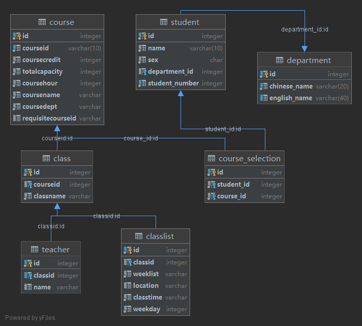

## CS307 Project Report (Midterm)

### Part 1. Group Info and Contribution

### Part 2. Task 1 Implementation & Introduction

Figure 1. UML diagram of the tables

### Part 3. Task 2 Implementation & Analysis

### Part 4. Task 3 Implementation & Analysis