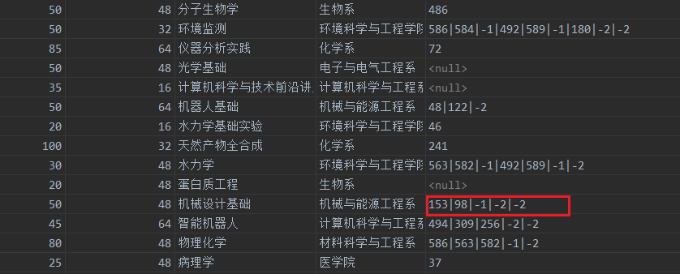

# CS307 Project Report (Midterm)

## Part 1. Group Info and Contribution


## Part 2. Task 1 Implementation & Introduction

### 1. Table Diagram

Figure 2-1 shows the UML diagram of the tables generated by DataGrip.


<center style="font-family:Arial;font-weight:bold">Figure 2-1. UML diagram of the tables</center>

### 2. Introduction

There are 7 tables in total:

The four tables `course`, `class`, `teacher`, `classlist` are used to store the data in `course_info.json`. The other three tables `student`, `department`, `course_selection` are used to store the data in `select_course.csv`. 

In `course_info.json`, each entry is the information of one class of one course. We extracted the information of the courses into the table `course`, and store the information of the classes in a one-to-many relation table `class`. We store the relation between teachers and classes, class lists and classes in the same way.

In `select_course.csv`, there are a one-to-many relation between student and department, and a many-to-many relation between student and course selection, So we divided them into three tables, with table `course_selection` having a foreign key with the table `course`.


## Part 3. Task 2 Implementation & Analysis

### 1. Preprocess the data in `course_info.json`

The script is `process_json.py`, some of the codes of processing `prerequisite` field are shown in Code 3-1.

```python
if not re.match("\\A[A-Za-z\\s]*\\Z", str(i['prerequisite'])):
    i['prerequisite'] = re.sub("\\((?P<inner>.)\\)", replace, str(i['prerequisite']))
    i['prerequisite'] = re.sub("\\A\\s", "", str(i['prerequisite']))
    i['prerequisite'] = re.sub("\\s(?P<lev>[ABCDI])", iden, str(i['prerequisite']))
    i['prerequisite'] = re.sub("\\(", "(|", re.sub("\\)", "|)", i['prerequisite']))
```

<center style="font-family:Arial;font-weight:bold">Code 3-1. Preprocess Python script (Part)</center>

#### (1) Make data more regular

First, we analyzed `course_info.json` and solved the following irregular data problems.

* ##### Space between Chinese course names and grades

  **Description**

  Some of the Chinese courses have space between course names and grades, such as

  ```
  大学物理 B(下)
  化学原理 A
  ```

  Since we will split the prerequisite by space, this will cause difficulties to the following process.

  **Solution**

  We found there are only `A`, `B`, `C`, `D`, `I`, `II`, `III` in course grades, so we used regular expression `\s[ABCDI]` to match the spaces and delete them.

* ##### Half-angle brackets in Chinese course names

  **Description**

  There are some half-angle brackets in Chinese course names, such as

  ```
  大学物理 B(下)
  ```

  Since we will judge the priority by the half-angle brackets, this will cause difficulties to the following process.

  **Solution**

  We found that this case will only happen in parts like `(上)`, `(下)`, so we used regular expression `\(.\)` to match and replace them.

* ##### Spaces and Tabs in data

  **Description**

  This kind of problem is found in fields `teacher`, `courseName`, `className` and `location`.

  In these fields, there might be Spaces and Tabs (mainly at the beginning), such as

  ```
  \tHisao Ishibuchi
   全球生物多样性保护
  ```

  This will make the data in database irregular and have unnecessary white spaces.

  **Solution**

  For fields which are not supposed to have white spaces, like `className` and `location`, we can simply match the white spaces by regular expression `\s+` and delete them.

  For fields that might have white spaces itself, we used regular expression `\A\s` to match the white spaces at the beginning of the filed and delete them.

#### (2) Change the separator

Though we mentioned below that we will use space to split the `prerequisite` field, we decided to change the separator to `|` at last because there are some English course names that have spaces.

We found that all of the `prerequisite` string that have English course names will only have one or less course in prerequisite, so we used regular expression `\A[A-Za-z\s]*\Z` to match English course names and exclude them. After that, we used `\s` to find all the spaces in `prerequisite` field and changed them into `|`.

We also match the brackets by using regular expression `\(` and `\)` and added the separator, so they will become `(|` and `|)`, which is more convenient to be split.


<center style="font-family:Arial;font-weight:bold">Figure 3-2. Preprocessd JSON file</center>

The preprocessed JSON file is shown in Figure 3-2.

### 2. Code structure of data importing

The basic structure of our data_importing scrips is constructed by 3 steps :

#### (1) Database connection part :

Using  **JDBC**  to connect with database,  we need two things : Driver class and variables like `URL`  `User` and `Password`, then we will get a connection object which can handle all operations we do to the database.

Consider the safety factor we catch the **Exception** the database send back, and do something about it like *role back* and *close database connection*.

* ##### variables need to made a 'connection'

  ```java
  // 参数：
  // jdbc协议:postgresql子协议://主机地址:数据库端口号/要连接的数据库名
  String database_name = "postgres";
  String host = "localhost:5432";
  // 数据库用户名
  String user = "postgres";
  // 数据库密码
  String password = "12345";
  ```

* ##### The functions of open database

  ```java
  private static void OpenDB() {
    String url = "jdbc:postgresql://" + host + "/" + dbName;
  
    // 1. 加载Driver类，Driver类对象将自动被注册到DriverManager类中
    try {
      Class.forName("org.postgresql.Driver");
    } catch (Exception e) {
      System.err.println("Cannot find the Postgres driver. Check CLASSPATH.");
      System.exit(1);
    }
  
    // 2. 连接数据库，返回连接对象
    try {
      conn = DriverManager.getConnection(url, user, password);
      System.out.println("Successfully connected to the database " + dbName + " as " user);
      conn.setAutoCommit(false);
    } catch (SQLException e) {
      System.err.println("Database connection failed");
      System.err.println(e.getMessage());
      System.exit(1);
    }
  }
  ```

* ##### The functions of close database

  ```java
    private static void CloseDB() {
      if (conn != null) {
        try {
        	// 如果存在未关闭的 prepared_statement 提交并关闭它
          if (stmt != null) {
            stmt.close();
            stmt = null;
          }
          //提交connection中的内容并关闭connection
          conn.commit();
          conn.close();
          conn = null;
          System.out.println("Successfully close the database " + dbName + " as " + user);
        } catch (Exception e) {
          System.err.println("Close database failed");
          System.err.println(e.getMessage());
          System.exit(1);
        }
      }
    }
  ```

<center style="font-family:Arial;font-weight:bold">Code 2-1. Connection to databse</center>

#### （2)  JSON file connection part:

​	Using the **GSON** lib to read from JSON file

```java
  //加载json文件中的信息到jsonArray
  public static void loadFromJson(String fileLocation) {
    try {
      //新建解析json文件的模块
      JsonParser parser = new JsonParser();  //创建JSON解析器
      BufferedReader in = new BufferedReader(
          new InputStreamReader(new FileInputStream(fileLocation), StandardCharsets.UTF_8),
          50 * 1024 * 1024); //设置缓冲区 编码
      jsonArray = (JsonArray) parser.parse(in);  //创建JsonArray对象
    } catch (FileNotFoundException e) {
      System.err.println("No JSON file found");
      System.err.println(e.getMessage());
      System.exit(1);
    }
  }
```

<center style="font-family:Arial;font-weight:bold">Code 2-2. Read json files</center>

####  (3)  main data importing part : 

​	We divide the whole things into 3 steps.

* ##### test connection, clear the table and make "prepared statement"

  ```java
  try {
    System.out.println("--START CLEAR TABLE COURSE--");
    OpenDB();
    if (conn != null) {
   	Statement stmt0 = conn.createStatement();
      stmt0.execute("TRUNCATE TABLE course RESTART IDENTITY CASCADE");
      stmt0.close();
    }
    CloseDB();
    System.out.println("--FINISH CLEAR TABLE COURSE--\n");
  } catch (SQLException e) {
    System.err.println("TEST Database connection failed");
    System.err.println(e.getMessage());
    System.exit(1);
  }
  ```

  <center style="font-family:Arial;font-weight:bold">Code 2-3-1. test connection and clear the table</center>

  ```java
    //准备导入数据库所需的jdbc::PreparedStatement, 以及对应的sql语句
    String sql_addCourseIfNotExist =
        "INSERT INTO course(id, totalCapacity, courseId, courseHour, courseCredit, courseName, courseDept) VALUES(?,?,?,?,?,?,?)" + "ON conflict(courseId)  DO NOTHING;";
    create_PS(sql_addCourseIfNotExist);
  ```

  ```java
    private static void create_PS(String sql) {
      try {
        if (conn != null) {
          stmt = conn.prepareStatement(sql);
        } else {
          System.err.println("Connection unaccomplished");
        }
      } catch (SQLException e) {
        System.err.println("Insert statement failed");
        System.err.println(e.getMessage());
        CloseDB();
        System.exit(1);
      }
    }
  ```

  <center style="font-family:Arial;font-weight:bold">Code 2-3-2. make prepared statement</center>

* ##### loop reads from JSON file and load the information into the corresponding object

  Although there is a time cost to re-depositing the information into the object，but we thought it would make our code more modular, which would help speed up and test later on.

  ```java
  //从json文件中读取对应序号的信息，创造course_info对象，准备后续输入数据库中
  course_info course_info = new course_info();
  //将json文件中的course相关信息，导入course_info对象中
  jsonToCourse(i, course_info, cnt);
  ```

  Let's use Course as an example to show you how to parse a JSON file

  ```java
    private static void jsonToCourse(int index, course_info course_info, int id) {
      //获取整个文件的JSONArray中目标序号的一条，作为JSONobject
      JsonObject jsonOBJ_courseArray = jsonArray.get(index).getAsJsonObject();
      //提取JSONobjects中的信息 存入对应对象中
      course_info.setId(id);
      course_info.setCourseId(jsonOBJ_courseArray.get("courseId").getAsString());
      course_info.setCourseCredit(jsonOBJ_courseArray.get("courseCredit").getAsInt());
      course_info.setTotalCapacity(jsonOBJ_courseArray.get("totalCapacity").getAsInt());
      course_info.setCourseHour(jsonOBJ_courseArray.get("courseHour").getAsInt());
      course_info.setCourseDept(jsonOBJ_courseArray.get("courseDept").getAsString());
      course_info.setCourseName(jsonOBJ_courseArray.get("courseName").getAsString());
    }
  ```

  <center style="font-family:Arial;font-weight:bold">Code 2-4. read from JSON files</center>

* ##### load data into database

  Loads the corresponding information to **Prepared Statement**, and then it loads into **Connection**

  ```java
  //将course_info对象中的信息导入数据库中
  courseToDatabase(course_info);
  ```

  in this section, we use **add Batch** functions, which we will talk about it later in part 4.

  ```java
  private static void courseToDatabase(course_info course_info) throws SQLException {
    PreparedStatement ps_addCourse = stmt;
    ps_addCourse.setInt(1, course_info.getId());
    ps_addCourse.setInt(2, course_info.getTotalCapacity());
    ps_addCourse.setString(3, course_info.getCourseId());
    ps_addCourse.setInt(4, course_info.getCourseHour());
    ps_addCourse.setInt(5, course_info.getCourseCredit());
    ps_addCourse.setString(6, course_info.getCourseName());
    ps_addCourse.setString(7, course_info.getCourseDept());
    ps_addCourse.addBatch();
  }
  ```

  flush the Batch and execute the code in it.

  ```java
  stmt.executeBatch();
  stmt.clearBatch();
  ```

  <center style="font-family:Arial;font-weight:bold">Code 2-5. load it into database</center>

### 3. Process of prerequisite

#### (1) Implementation

We processed the prerequisite expression in two steps:

1. Change the string expression into an **integer** array.
2. Rewrite the expression in post-order.

When we get a prerequisite expression, we first split it into an array using the separator `|`. Then we go through the array.

* If we find a course name, then we query in the database to find the corresponding course id.
  * If we find the id, replace the course name with id.
  * If we don't find the id, drop it.

* If we find `(`, `)`, `并且`, `或者`, we will replace `(` with `-3`, replace `)` with `-4`, replace `或者` with `-1` and replace `并且` with `-2`.

We will delete the duplicate course names in the same time.

```java
int[] stack = new int[100];
int top = 0, temp_int, ptr = 0;
for (int i = 0; i < t; i++) {
  switch (fin_arr[i]) {
    case -1:
    case -2:
    case -3:
      stack[top++] = fin_arr[i];
      break;
    case -4:
      while (true) {
        temp_int = stack[--top];
        if (temp_int == -3) {
          break;
        } else {
          fin_arr[ptr++] = temp_int;
        }
      }
      break;
    case -5:
      break;
    default:
      fin_arr[ptr++] = fin_arr[i];
      break;
  }
}
while (top >= 1) {
  fin_arr[ptr++] = stack[--top];
}
```

<center style="font-family:Arial;font-weight:bold">Code 3-2. Transform into post-order</center>

Then we used **stack** to transform the expression into a post-order expression. Go through the array again.

* If we meet a course id (positive), put it into the expression directly.
* If we meet `-3`, which means `(`, push it into stack.
* If we meet `-4`, which means `)`, pop the stack until meet `-3`. Don't put `-3` into expression. Drop it.
* If we meet `-1` or `-2`, just push it into stack.

When we go through all the elements in the array, pop all the items left in the stack to the end of the expression.

Code 3-2 shows the Java code of generating the post-order expression.

#### (2) Advantages

This implementation has four advantages.

* ##### High Compatibility

  This method of transforming into post-order can process any form of Boolean expressions and store it into database, no matter it's a SOP, POS, or a complicated expression.

* ##### One row in table

  This method only need one row to store in database, and it can allow column `prerequisite` to be directly stored in table `course` instead of storing it in a new table and adding foreign keys.

  This will reduce the complexity of query.

* ##### Easy to resolve

  Post-order expressions is a computer-friendly form of expression. Thus, it's easy to resolve when we use it in the future.

* ##### Optimizable

  When we decide if someone satisfies the prerequisite, we need to connect to the database and calculate the expression while querying.

  If one expression have `n` courses, the number we query the database can be **equal or less than** `n` after optimizing. 

#### (3) Problems



<center style="font-family:Arial;font-weight:bold">Figure 3-3. Prerequisite in database</center>

Figure 3-3 shows the final form of prerequisite in database. There are still one problem that the number of Boolean operators might exceed the reasonable bound as we highlighted in the figure. The reason is shown below:

```
(A or B) and (C or D) 	--[A and B Invalid]--> 		() and (C or D)
() and (C or D) 		--[postorder]--------> 		C D or and
```

However, after some calculation, we found that only when there are more than two layers of brackets, this problem cause bugs. Since there are no data in prerequisite that have more than two layers of brackets, this problem has no influence. We only need to calculate the post-order expression in the normal steps and simply ignore the Boolean operators left.

### 4. Optimize the speed of importing

<<<<<<< Updated upstream
#### (1) BATCH

​	The first time we completed the import, we found that it took a lot of time,through searching the reason, 	we found that the long time was caused by our repeated communication with the database.

​	Every time we execute a database statement, a communication with the database occurs. This can be a 	huge time drain.

* ##### bad version

  The following code is executed each time an SQL statement is generated

  ```java
  psts.executeUpdate();
  ```

  <center style="font-family:Arial;font-weight:bold">Code 4-1. Bad code</center>

* #####  what we done

  * ###### close the **auto_commit** of `connection`

    ​	if we don't close the **auto_commit** it will still commit each time we do something to the `connection`, the speed would stay slow.

    ```java
    conn.setAutoCommit(false);
    ```

  * ###### add Batch

    ​	This code is executed after each SQL statement is generated, Its purpose is to put unprocessed SQL statements on a `stack`.

    ​	In our test code we found that the first code add into batch will not execute until the last , just act like `FILO`.

    ```java
    psts.addBatch();
    ```

    ​	This code executes once after a certain number of passes, and that number of times is the **BATCH_SIZE **in the code. **BATCH_SIZE** is a very impotent variable, it will affect the speed of importing data.

    ​	The greater **BATCH_SIZE** means that less time it will execute but more numbers of SQL it will execute in in the same time. Its a funny factors, because it generate a balance. 

    ​	There is no BEST **BATCH_SIZE** for every one. It is factored by different grade of CPU you use. If your CPU is better then more SQL you can handle at the same time, so greater **BATCH_SIZE** will perfectly suit you. But if your CPU is not so good it cannot handle so much things, if you push him to do so by setting a very big **BATCH_SIZE**, it will Lift a stone only to drop it on your own feet. You will face more risk of a CPU error. So less **BATCH_SIZE** suits you more.

    ```java
    if (cnt % BATCH_SIZE == 0) {
      stmt.executeBatch();
      stmt.clearBatch();
      conn.commit();
    }
    ```

    ​	This code executes once when all SQL statement has load into Batch or already execute. This will ensure that after we insert into a table, all SQL will be executed, no data lose.

    ```java
    if (cnt % BATCH_SIZE != 0) {
      stmt.executeBatch();
      stmt.clearBatch();
      conn.commit();
    }
    ```

    <center style="font-family:Arial;font-weight:bold">Code 4-2. addBatch()</center>

* ##### why it better

  What we did was apply the Batch feature in JDBC, This touches on the different ways SQL commands are loaded in JDBC : **statement** and **prepared statement**

  * ###### statement

    Use the Statement object. The Statement object is used for processing when only one-time access to the database is performed. Prepared Statement objects are more expensive than statements and provide no additional benefit for one-time operations.

  * ###### prepared statement

    The SQL Statement is precompiled by the database system (if the JDBC driver supports it). The precompiled SQL query can be reused for future queries, making it faster than the query generated by the Statement object.

  **So how can we choose from this two ?**

  * ###### **prepared statement** is designed to be optimal for multiple use

    ​	*The first execution of a Prepared Statement is expensive.* Its performance is reflected in the subsequent repeated execution. When we generate a basic query using **prepared statement** the JDBC driver sends a network request to parse the data and optimize the query. Execution generates another network request. *In JDBC drivers, reducing network traffic is the ultimate goal.* If my program requires only one request during execution, use **Statement**. For a **Statement**, the same query generates only one network-to-database communication.

  * ###### **prepared statement** has greatly improved security

    ​	If you use a precompiled statement. Anything you pass in will not have any matching relationship with the original statement. As long as you use all the precompiled statements, you don't have to worry about the incoming data. If you use a normal statement, you might want to specify a drop,;And so on to do painstaking judgment and overthinking.

  So lets get back to **BATCH**

  **Statement** and **prepared statement** performs different while using **BATCH**. 

  ​	Using `Statement.addBatch(SQL)` to implement batch processing can send different types of SQL statements to the database, but these SQL statements are not precompiled and inefficient to execute. And you need to list each SQL statement. The `PreparedStatement.addBatch ()` can only be used in the same type parameters of different SQL statements, this form of batch is often used for bulk insert data in the same table, or batch update table data.

  **conclusion**

  ​	When the previous code communicates with the database, it establishes the connection first, and the cost of establishing the connection is the highest. Then it issues a SQL statement and closes the connection after execution. Another problem is that the SQL statements that are sent are sent over the network, which is also much more expensive than local calls .If you want to insert or update a batch of data into the database, or use the previous method, it will take a lot of time. However, if you use batch processing, you can save most of the cost in both convenience and the speed will be faster.

#### (2) Hash_MAP

To my surprise, after we use `BATCH` to make our code faster, our code has not become faster even a little bit. Its because that beside the `INSERT` statement, we still use a lot of `SELECT` statement while inserting data. It is the same reason why make our code slow. So reduce `SELECT ` must be done. 

But how ? We choose ` HASH_MAP`.

* ##### when we need hash_map ?

  The answer is simple --- **foreign key**.

  This is a relational database, so we must have `foreign key`, in order to maintain a `foreign key` we have to get the information of what `foreign key` is pointing to.

  Like the `foreign key` between table `course` and `class`.

  

  <center style="font-family:Arial;font-weight:bold">Figure 4-1. foreign key</center>

  As you can see, while we insert into table class, we have to know the information of `Id` in table `course`  using what we already known `courseId` in table `course`.

  So we can maintain a `Hash_MAP` to store the relations of these two things.

* ##### making Hash_MAP

  create a Hash_MAP :

  ```java
  private static final Map<String, Integer> MAP_course = new HashMap<>();       //courseId->Id
  ```

  store the relation into it , while inserting the data into database : 

  ```java
  //将对应course_Id->id的关系加载到hashmap中
  if (!MAP_course.containsKey(course_info.getCourseId())) {
    MAP_course.put(course_info.getCourseId(), cnt);
  }
  ```

  <center style="font-family:Arial;font-weight:bold">Code 4-3. Create Hash_MAP</center>

* ##### using Hash_MAP

  search from the Hash_MAP, to get what we need in O(1) time cost.

  ```java
  String course_Id_real = jsonOBJ_classArray.get("courseId").getAsString();
  int courseId = MAP_course.get(course_Id_real);
  class_info.setId(id);
  ```

  <center style="font-family:Arial;font-weight:bold">Code 4-4. Use Hash_MAP</center>

#### (2)  what we achieve

As we can see in diagram.  For table student in `csv` form,  while without speed up on `localhost` we got 3042 records / s.


<center style="font-family:Arial;font-weight:bold">Figure 4-2. Diagram of csv localhost no acceleration</center>

 with speed up on `localhost` we got 110678 records / s. Unbelievably fast.


<center style="font-family:Arial;font-weight:bold">Figure 4-3. Diagram of csv localhost with acceleration</center>

Now lets look at the data on the server database. For table student in `csv` form,  while without speed up on `server` we got 27 records / s. Unbearably slow ! 


<center style="font-family:Arial;font-weight:bold">Figure 4-4. Diagram of csv server no acceleration</center>

with speed up on `server` we got 5919 records / s. I can live with it.


<center style="font-family:Arial;font-weight:bold">Figure 4-5. Diagram of csv server with acceleration</center>

On `localhost` we got 36 times faster, but on `server` we got 108 times faster !!!

Does it seems like the speed up code just have only a slight advantage on `localhost` ?  YES of course ! This is because of the cost of connecting with database on local host is very small. So that makes sense. 

This diagram is really shocked but unfortunately  we can't see the data `unaccelerated localhost` because  it is too slow (only 27) .

Another things we can see  is that , with different  `Batch_Size`  the `server` performance different with `localhost`. Data on the `server` shows that the less `Batch_size` we choose the better performance we got. But on `localhost` 30000 seems to be the best choice. This is because the CPU we got on `localhost` works better than  CPU on `server`. It validates what I said earlier .


<center style="font-family:Arial;font-weight:bold">Figure 4-5. Diagram of csv Files</center>

This is the diagram of `JSON` files after acceleration. We want to show that because of read the `JSON` files need more time than `CSV` files.  so there is speed difference between` JSON` and `CSV`. And also because of the `JSON` files is much smaller than the `CSV` files, the acceleration rate of `JSON` files is smaller than `CSV` files .It validates what I said earlier .


<center style="font-family:Arial;font-weight:bold">Figure 4-2. Diagram of JSON File</center>
=======


## Part 4. Task 3 Implementation & Analysis

### 1. Brief Introduction

Our dataset is a dataset about E-Commerce found in [Kaggle](https://www.kaggle.com/datasets). Figure 4-1 shows the detail of the dataset.


<center style="font-family:Arial;font-weight:bold">Figure 4-1. E-Commerce dataset</center>

We implemented this using `C++`, and we ran this program on `Windows(x86)` and `Linux(x86)`.


### 2. Basic structure

I designed two `structs`, `Table `and `Record `to represent the structure of a table.

The basic structure of a table is a `vector` of `Record*`.

```cpp
void filter_index() {
  cur = 0;
  index_idx = -1;
  indexused = false;
  while (true) {
    if (cur > 6) {
      error_msg = "Error: Too much condition added.\n";
      error_hap = true;
      return;
    }
    cin >> key[cur];
    if (key[cur] == "-1") {
      break;
    } else if (!indexused) {
      if (key[cur] == "InvoiceNo" || key[cur] == "invoiceno") {
        indexused = true;
        index_idx = cur;
        temp_index = InvoiceNo_index;
      } else if (key[cur] == "StockCode" || key[cur] == "stockcode") {
        indexused = true;
        index_idx = cur;
        temp_index = StockCode_index;
      } else if (key[cur] == "CustomerID" || key[cur] == "customerid") {
        indexused = true;
        index_idx = cur;
        temp_index = CustomerID_index;
      }
    }
    cin >> value[cur];
    cur++;
  }
  if (indexused) {
    if (temp_index->count(value[index_idx])) {
      rset = temp_index->at(value[index_idx]);
    }
  }
  for (int j = 0; j < cur; j++) {
    if (j == index_idx) {
      continue;
    }
    if (key[j] == "InvoiceNo" || key[j] == "invoiceno") {
      for (int i = 0; i < rset.size(); i++) {
        if (rset[i]->InvoiceNo != value[j]) {
          rset[i]->unselected = true;
        }
      }
    } else if (key[j] == "StockCode" || key[j] == "stockcode") {
      for (int i = 0; i < rset.size(); i++) {
        if (rset[i]->StockCode != value[j]) {
          rset[i]->unselected = true;
        }
      }
    } else if (key[j] == "Quantity" || key[j] == "quantity") {
      if (rset.size()) {
        for (int i = 0; i < rset.size(); i++) {
          if (rset[i]->Quantity != value[j]) {
            rset[i]->unselected = true;
          }
        }
      } else {
        for (int i = 0; i < t->records.size(); i++) {
          if (t->records[i]->Quantity == value[j]) {
            rset.push_back(t->records[i]);
          }
        }
      }
    } else if (key[j] == "UnitPrice" || key[j] == "unitprice") {
      if (rset.size()) {
        for (int i = 0; i < rset.size(); i++) {
          if (rset[i]->UnitPrice != value[j]) {
            rset[i]->unselected = true;
          }
        }
      } else {
        for (int i = 0; i < t->records.size(); i++) {
          if (t->records[i]->UnitPrice == value[j]) {
            rset.push_back(t->records[i]);
          }
        }
      }
    } else if (key[j] == "CustomerID" || key[j] == "customerid") {
      for (int i = 0; i < rset.size(); i++) {
        if (rset[i]->CustomerID != value[j]) {
          rset[i]->unselected = true;
        }
      }
    } else if (key[j] == "Country" || key[j] == "country") {
      if (rset.size()) {
        for (int i = 0; i < rset.size(); i++) {
          if (rset[i]->Country != value[j]) {
            rset[i]->unselected = true;
          }
        }
      } else {
        for (int i = 0; i < t->records.size(); i++) {
          if (t->records[i]->Country == value[j]) {
            rset.push_back(t->records[i]);
          }
        }
      }
    } else {
      error_msg = "Error: Invalid column name '" + key[j] + "'.\n";
      error_hap = true;
      return;
    }
  }
};
```

<center style="font-family:Arial;font-weight:bold">Code 4-1. Function of finding rows</center>

Code 4-1 shows the function of finding rows we wanted, which is the core code of this program.

We first generate a result set by one of the select conditions, then we go through the other conditions to exclude the rows from the current result set. At last, the rows remaining in the result set are the rows we want.


### 3. Index

We want to prove that adding index can speed up the operations of selecting, but it will slow down the speed of updating, deleting, inserting and table loading.

#### (1) Implementation

We implemented index by `map` in `C++`, which is actually supported by a binary tree.

This is similar to the index structure in database.

```cpp
map<string, vector<Record*>> *InvoiceNo_index = new map<string, vector<Record*>>(),
							 *StockCode_index = new map<string, vector<Record*>>(),
            				 *CustomerID_index = new map<string, vector<Record*>>();

void add_index(map<string, vector<Record*>>* index, string key, Record* value) {
  map_itr = index->find(key);
  if (map_itr != index->end()) {
    map_itr->second.push_back(value);
  } else {
    temp.push_back(value);
    index->insert(pair<string, vector<Record*>>(key, temp));
    temp.pop_back();
  }
};
```

<center style="font-family:Arial;font-weight:bold">Code 4-2. Function of adding indexes</center>

Since we don't have column with unique constraints, our index is a map from `string` (column values) to a `vector` of `Record*`. The function of adding indexes is shown in Code 4-2.

#### (2) Advantages


<center style="font-family:Arial;font-weight:bold">Figure 4-4. Adding Indexes' Influences on Execution Time
</center>

As we mentioned above, when we are selecting rows, we will first generate a result set (actually a `vector` of `Record*`) according to one of the conditions.

After adding indexes, if we find one of the conditions is applied on a column with index, then we will use it to generate the result set. Just find the value of the index map (a `vector` of `Record*`) and copy it to the result set. This is also shown in Code 4-1.

Adding index will save a lot of time than matching all the rows one by one. In testcases, the average query time reduced about `80%` after adding index. This is shown in Figure 4-4.

#### (3) Drawbacks

After adding index, every time a new row is inserted, the index must be updated. More indexes, more time cost.

We added index on three of the columns. After adding indexes, the time cost in loading table raised about `60%`. This is also shown in Figure 4-4.

Also, after adding index, there are a lot more memory used to store the indexes (`map` in my program).

#### (4) Analysis

Adding index can improve the speed of finding corresponding rows, while it will slow down the speed of inserting, updating, deleting rows. Also, it will cause more storage cost.

In most cases, there are far more select operations that other operations, so adding index on some of the columns is recommended in most cases.


### 4. User privileges management

We want to prove that database have complicated user privilege management and schema managements.

#### (1) Our implementation

I used a struct to represent the users. They have three different privileges: `SuperUser`, `Admin` and `NormalUser`. This is shown in Code 4-3.

```c++
enum priv { SuperUser, Admin, NormalUser };
struct User {
  string userName;
  string password;
  priv identity;
};
map<string, User*> user_list;
```

<center style="font-family:Arial;font-weight:bold">Code 4-3. User privileges implementation</center>

There are only one `SuperUser`, who can create users, lift privileges and check privileges.

`Admin` can `insert`, `delete`, `update`, `select` the table.

`NormalUser` can only `select` the table.

Any user can switch to any other user by username and password.

These are all demonstrated in Figure 4-6.


<center style="font-family:Arial;font-weight:bold">Figure 4-4. User privileges demonstration</center>

#### (2) Database Privileges

We tested PostgreSQL on it's privilege management and schema managements. The details are shown in Figure 4-5.


<center style="font-family:Arial;font-weight:bold">Figure 4-5. PostgreSQL user privileges</center>

#### (3) Compare

PostgreSQL's user privilege management is based on schema management, and the privileges one user have can be divided into small parts like `select`, `insert`, `update`, `delete` and so on. Also, if we have gave a user some privileges, we cannot delete the user until we revoke the privileges.

Compared with our program, the database's implementation of user privilege management is far more complicated compact. In the same time, it's also more flexible because it can be divided into small parts.


### 5. Query & IO Speed

We want to prove that DBMS has more effective data management methods, so DBMS will have higher speed in query and IO.

We tested our program and two different DBMS, PostgreSQL and MySQL, on the platform of Windows(x86) and Linux(x86).

#### (1) Our Program

* ##### Windows

  The load time (I/O time cost) and CRUD time on Windows are shown in Figure 4-6-a, 4-6-b, 4-6-c.

  

  <center style="font-family:Arial;font-weight:bold">Figure 4-6-a. Windows I/O time (Program)</center>

  

  <center style="font-family:Arial;font-weight:bold">Figure 4-6-b. Windows select time (Program)</center>


<center style="font-family:Arial;font-weight:bold">Figure 4-6-c. Windows CRUD time (Program)</center>

* ##### Linux

  The load time (I/O time cost) and CRUD time on Linux are shown in Figure 4-7-a, 4-7-b, 4-7-c.


<center style="font-family:Arial;font-weight:bold">Figure 4-7-a. Linux I/O time (Program)</center>


<center style="font-family:Arial;font-weight:bold">Figure 4-7-b. Linux select time (Program)</center>


<center style="font-family:Arial;font-weight:bold">Figure 4-7-c. Linux CRUD time (Program)</center>

#### (2) PostgreSQL

* ##### Windows

  The load time (I/O time cost) and CRUD time on Windows are shown in Figure 4-8-a, 4-8-b, 4-8-c.

  

  <center style="font-family:Arial;font-weight:bold">Figure 4-8-a. Windows I/O time (PostgreSQL)</center>

  

  <center style="font-family:Arial;font-weight:bold">Figure 4-8-b. Windows select time (PostgreSQL)</center>

  

  <center style="font-family:Arial;font-weight:bold">Figure 4-8-c. Windows CRUD time (PostgreSQL)</center>

* ##### Linux

  The load time (I/O time cost) and CRUD time on Linux are shown in Figure 4-9-a, 4-9-b, 4-9-c.

  

  <center style="font-family:Arial;font-weight:bold">Figure 4-9-a. Linux I/O time (PostgreSQL)</center>

  

  <center style="font-family:Arial;font-weight:bold">Figure 4-9-b. Linux select time (PostgreSQL)</center>

  

  <center style="font-family:Arial;font-weight:bold">Figure 4-9-c. Linux CRUD time (PostgreSQL)</center>

#### (3) MySQL

* ##### Windows

  The load time (I/O time cost) and CRUD time on Windows are shown in Figure 4-10-a, 4-10-b, 4-10-c.

  

  <center style="font-family:Arial;font-weight:bold">Figure 4-10-a. Windows I/O time (MySQL)</center>

  

  <center style="font-family:Arial;font-weight:bold">Figure 4-10-b. Windows select time (MySQL)</center>

  

  <center style="font-family:Arial;font-weight:bold">Figure 4-10-c. Windows CRUD time (MySQL)</center>

* ##### Linux

  The load time (I/O time cost) and CRUD time on Linux are shown in Figure 4-11-a, 4-11-b, 4-11-c.

  

  <center style="font-family:Arial;font-weight:bold">Figure 4-11-a. Linux I/O time (MySQL)</center>

  

  <center style="font-family:Arial;font-weight:bold">Figure 4-11-b. Linux select time (MySQL)</center>

  

  <center style="font-family:Arial;font-weight:bold">Figure 4-11-c. Linux CRUD time (MySQL)</center>

#### (4) Analysis

We designed two diagrams shown as Figure 4-12-a and 4-12-b to visualize the data.


<center style="font-family:Arial;font-weight:bold">Figure 4-12-a. Execution time compare (Windows)</center>


<center style="font-family:Arial;font-weight:bold">Figure 4-12-b. Execution time compare (Linux)</center>

#### (5) Compare

Compared with Windows, Linux system's speed is about one time faster on the whole.

* In I/O speed, our program is similar to PostgreSQL, while MySQL is always about 2 times slower than our program.

* In select and CRUD speed, DBMS are much more slower than our program, especially MySQL.

So generally, our program has the highest speed, and MySQL has the lowest speed.

We want to prove that DBMS are more effective, but the result is contradictory to our expectation.

We think there are some possible explanations:

1. For DBMS, there are much more "unnecessary" things to handle while executing a DML statement, like log recording, data organizing and so on to make sure it will be stable and reliable, while our program will just do the "necessary" things: just update, select, delete or insert rows.
2. DBMS need to manage multiple tables and databases at the same time, along with complicated privilege management and schemas, while our program just simulated one table with no schema and a simple privilege management.
3. DBMS might interactive with hard disk during execution, for they need to store the data into disk if there are too much data in buffer, so there might be I/O time cost, while our program will just load the table into memory and interactive with memory all the time.
>>>>>>> Stashed changes


### 6. Conclusion

DBMS is effective on the premise of full and reliable functions.

Just as what we compared above, DBMS have a lot of excellent designs, such as index, user privilege management and so on. It's meaningless if we just compare the execution time of our program with DBMS if we don't take all of the other functions into consideration.

Anyhow, DBMS have it's own reason for being so classic and existing for such a long time.